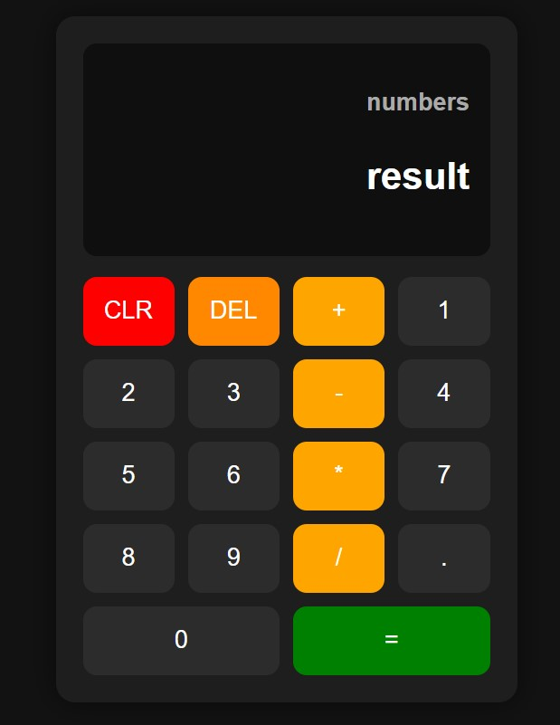

# 🧮 Calculator Web App

A simple and interactive calculator built using **HTML, CSS, and JavaScript**.  
This project performs basic arithmetic operations and provides a clean UI similar to a real calculator.

---

## 🚀 Features

- ➕ Addition  
- ➖ Subtraction  
- ✖️ Multiplication  
- ➗ Division  
- 🔁 Chain Calculation (e.g., `2 + 3 + 4`)  
- 🧹 Clear (CLR) button  
- ⌫ Delete (DEL) button  
- 📟 Live expression display  
- 🎨 Modern responsive UI  

---

## 🛠️ Technologies Used

- HTML5  
- CSS3 (Grid Layout)  
- JavaScript (DOM Manipulation & Logic)  

---

## 📸 Preview

  

---

## ⚙️ How It Works

- User clicks number buttons → values stored in variables (`firstNumber`, `secondNumber`)
- Operator buttons set the current operation
- When `=` is clicked → calculation is performed using a custom `operate()` function
- Chain calculation allows continuous operations without pressing `=` each time

---

## 🧠 Learning Outcomes

From this project, I learned:

- DOM selection and event handling  
- Managing application state (firstNumber, secondNumber, operator)  
- Building logic for real-world applications  
- Creating responsive UI using CSS Grid  
- Debugging and improving code step-by-step  

---

## 🔮 Future Improvements

- ✅ Decimal support  
- ⌨️ Keyboard input support  
- 📱 Mobile responsiveness improvements  
- ⚠️ Better error handling (like divide by zero)  

---

## 💡 Author

**Abdul Samad**  
BCA Student | Aspiring Web Developer  

---

## ⭐ Support

If you like this project, consider giving it a ⭐ on GitHub!
